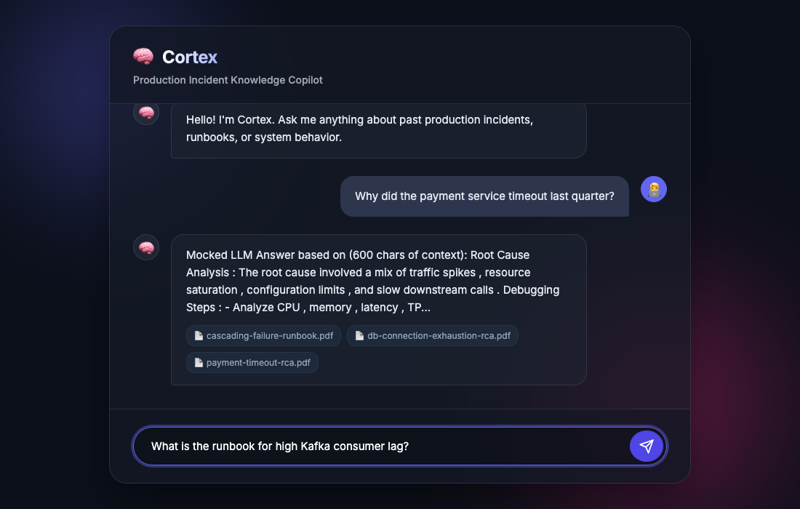

# Cortex 🧠🚨



Cortex is a **production incident knowledge copilot** that helps engineers quickly understand **why incidents happened** by querying historical **RCAs, runbooks, and operational documents**.

It provides **grounded, source-backed answers** using a **hybrid retrieval system** — without hallucinations and without relying on paid LLM APIs.

---

## ✨ What Cortex Does

- 🔍 Answers production incident questions (timeouts, Kafka lag, DB exhaustion, CPU spikes, Redis outages)
- 📚 Searches across historical RCAs and runbooks
- 🧠 Uses **hybrid retrieval (TF-IDF + semantic embeddings)**
- ⚖️ Ranks results using **weighted hybrid scoring**
- 🛑 Prevents hallucinations with strict grounding
- 🧾 Returns answers with **document-level source attribution**
- 💸 Fully offline, zero-cost setup

Example questions:
- *Why did the payment service timeout last quarter?*
- *How do we prevent cascading failures?*
- *Why did Kafka consumer lag occur?*
- *What happens if Redis goes down?*

---

## 🏗️ Architecture Overview

```

PDF Documents
↓
Text Extraction & Sanitization
↓
Chunking with Overlap
↓
TF-IDF Vectorization        Dense Embeddings
↓                           ↓
FAISS Index (Lexical)   FAISS Index (Semantic)
↓        ↓
Hybrid Retrieval + Weighted Ranking
↓
FastAPI (/ask)
↓
Grounded Answer + Sources

```

---

## 🧠 Design Principles

### Grounded answers only
Cortex never invents information. If an answer is not present in the knowledge base, it responds with:
```

Answer not found in knowledge base.

```

### No hallucinations by design
- No generative model produces facts
- Answers are derived strictly from retrieved documents

### Offline-first
- No OpenAI APIs
- No paid inference services
- Runs entirely on local infrastructure

---

## 🛠️ Tech Stack

- **Python**
- **FastAPI** – API layer
- **FAISS** – Vector similarity search
- **Scikit-learn (TF-IDF)** – Lexical embeddings
- **Sentence-Transformers** – Semantic embeddings (local)
- **NLTK** – Tokenization
- **Uvicorn** – ASGI server

---

## 📂 Project Structure

```

cortex/
├── app/
│   └── main.py          # FastAPI application
├── scripts/
│   ├── extract_text.py  # PDF → clean text
│   ├── chunk_docs.py    # Chunking logic
│   ├── build_index.py   # TF-IDF FAISS index
│   ├── build_embedding_index.py  # Semantic FAISS index
│   └── retrieve.py      # Local retrieval tests
├── docs/
│   ├── raw_pdfs/        # Sanitized PDFs
│   └── clean_text/      # Extracted text
├── index/               # Generated locally (gitignored)
│   ├── faiss.index
│   ├── faiss_embeddings.index
│   └── metadata.pkl
└── README.md

````

---

## 🚀 Getting Started

### 1️⃣ Create virtual environment
```bash
python3 -m venv venv
source venv/bin/activate
````

### 2️⃣ Install dependencies

```bash
python3 -m pip install -r requirements.txt
```

### 3️⃣ Build indexes

```bash
python3 scripts/build_index.py
python3 scripts/build_embedding_index.py
```

### 4️⃣ Run the API

```bash
uvicorn app.main:app --reload
```

---

## 🔌 API Usage

### Health Check

```http
GET /health
```

Response:

```json
{ "status": "ok" }
```

---

### Ask a Question

```http
POST /ask
Content-Type: application/json
```

Request:

```json
{
  "question": "Why did payment service timeout last quarter?"
}
```

Response:

```json
{
  "question": "Why did payment service timeout last quarter?",
  "answer": "The root cause involved traffic spikes, resource saturation, configuration limits, and slow downstream calls.",
  "sources": [
    "payment-timeout-rca.txt",
    "cascading-failure-runbook.txt"
  ]
}
```

---

## 🧪 Hallucination Guardrail Example

Request:

```json
{
  "question": "What is the company refund policy?"
}
```

Response:

```json
{
  "answer": "Answer not found in knowledge base."
}
```

---

## 🎯 Use Cases

* On-call engineers debugging incidents
* New team members learning from past outages
* SREs analyzing recurring failure patterns
* Backend engineers preparing postmortems

---

## 📌 Future Improvements

* Integrate LLM APIs with optimized prompt engineering and context window management; modular backend supports pluggable data sources and retrieval strategies.
* Add evaluation harness for retrieval quality
* Optional local LLM summarization (guarded)
* Dockerize for deployment
* UI dashboard for search & analytics
* Role-based access control

---

## 🧑‍💻 Author

Built by **Bhargab Nath**

---

## ⭐ Why Cortex Matters

Cortex demonstrates how to build **production-safe AI systems** that:

* prioritize correctness over fluency
* avoid hallucinations by design
* apply IR + ML techniques responsibly