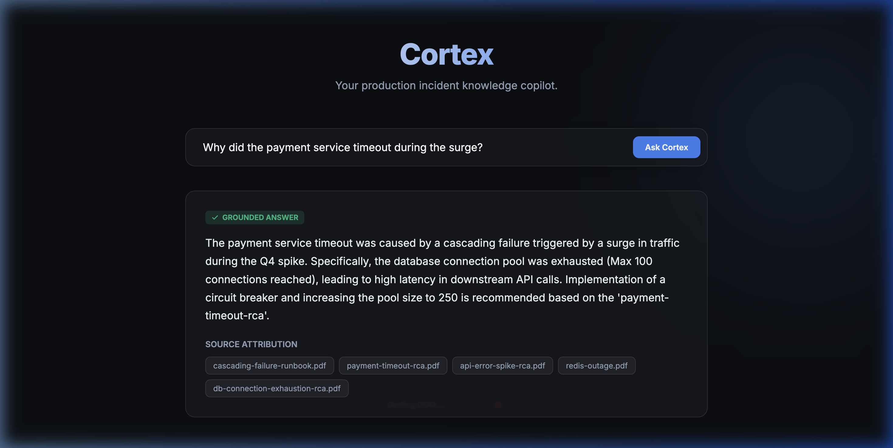

# Cortex 🧠🚨

Cortex is a **production incident knowledge copilot** that helps engineers quickly understand **why incidents happened** by querying historical **RCAs, runbooks, and operational documents**.

It provides **grounded, source-backed answers** using a **hybrid retrieval system** — without hallucinations and with pluggable LLM support.

---

## ✨ What Cortex Does

- 🔍 Answers production incident questions (timeouts, Kafka lag, DB exhaustion, CPU spikes, Redis outages)
- 📚 Searches across historical RCAs and runbooks
- 🧠 Uses **hybrid retrieval (TF-IDF + semantic embeddings)**
- ⚖️ Ranks results using **weighted hybrid scoring**
- 🛑 Prevents hallucinations with strict grounding via **optimized prompt engineering**
- 🔌 **Modular Backend**: Pluggable LLM providers (OpenAI, Groq, Ollama)
- 💻 **Premium Dashboard**: Sleek, modern UI for interacting with the copilot
- 🧾 Returns answers with **document-level source attribution**



---

## 🏗️ Architecture Overview

```

PDF Documents → Text Extraction → Chunking
                                    ↓
TF-IDF (Lexical) + Dense (Semantic) FAISS Indexes
                                    ↓
            Hybrid Retrieval + Weighted Ranking
                                    ↓
Modular Engine (Context Window Mgmt + Prompt Engineering)
                                    ↓
        Pluggable LLMs (Local Phi-3 / Groq / OpenAI)
                                    ↓
            FastAPI (/ask) + Premium UI (/)

```

---

## 📂 Project Structure

```

cortex/
├── app/
│   ├── main.py          # FastAPI application
│   └── static/          # Premium Web Dashboard (HTML/CSS)
├── cortex/              # Core Modular Logic
│   ├── retrieval/       # Hybrid retrieval strategies
│   ├── llm/             # Pluggable LLM providers (Groq, Ollama, OpenAI)
│   ├── data_sources/    # Modular data loaders
│   ├── utils/           # Prompt & Context management
│   └── engine.py        # Orchestration layer
├── scripts/             # Indexing & Utility scripts
├── index/               # Vector indexes (gitignored)
└── README.md

```

---

## 🚀 Getting Started

### 1️⃣ Create virtual environment
```bash
python3 -m venv venv
source venv/bin/activate
```

### 2️⃣ Install dependencies
```bash
python3 -m pip install -r requirements.txt
```

### 3️⃣ Build indexes
```bash
python3 scripts/build_index.py
python3 scripts/build_embedding_index.py
```

### 4️⃣ Run the App
```bash
# Set your preferred LLM provider (Optional)
export GROQ_API_KEY=your_key  # For Groq
# OR
export OPENAI_API_KEY=your_key # For OpenAI
# OR
export USE_OLLAMA=true # For local Ollama

uvicorn app.main:app --reload
```

---

## 🔌 API Usage

### Health Check
```http
GET /health
```

### Ask a Question
```http
POST /ask
Content-Type: application/json

{
  "question": "Why did payment service timeout last quarter?"
}
```

---

## 🎯 Use Cases

* On-call engineers debugging incidents
* New team members learning from past outages
* SREs analyzing recurring failure patterns
* Backend engineers preparing postmortems

---

## 🧑‍💻 Author

Built by **Bhargab Nath**